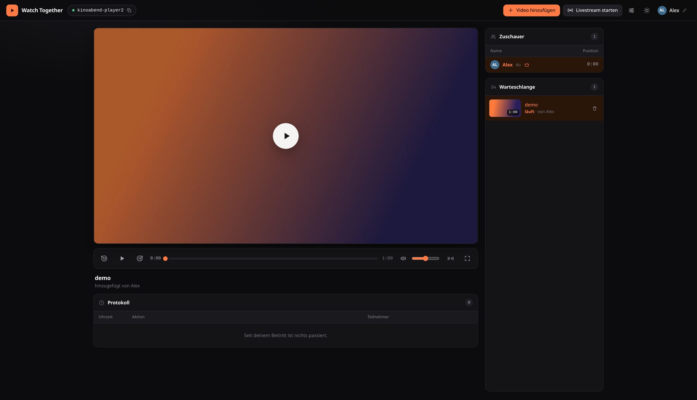
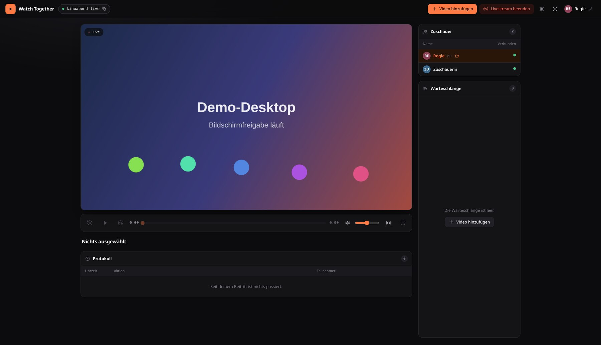
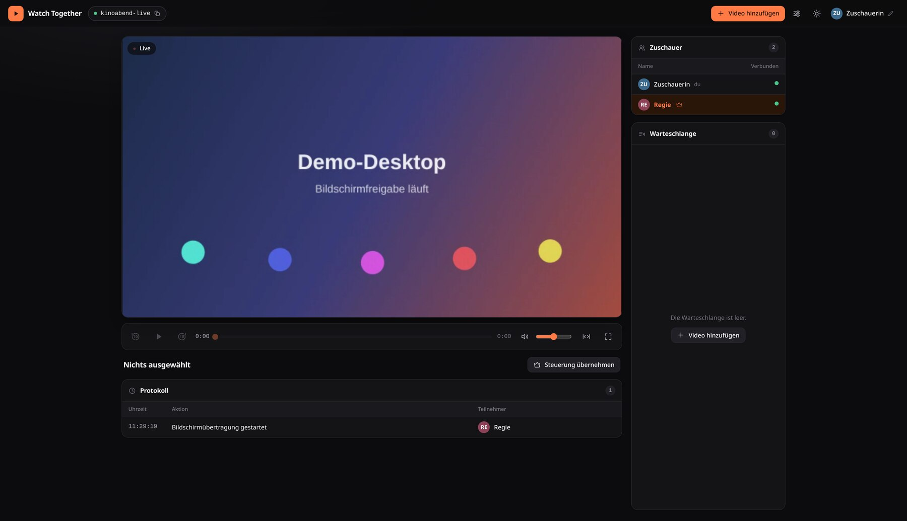
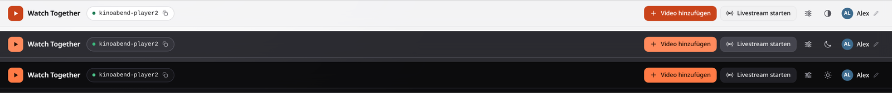
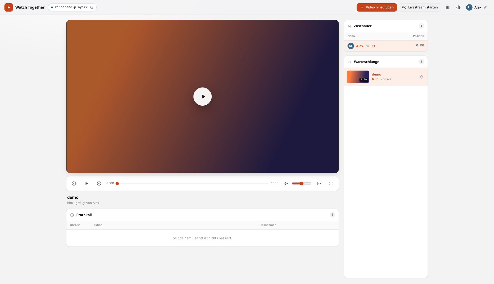
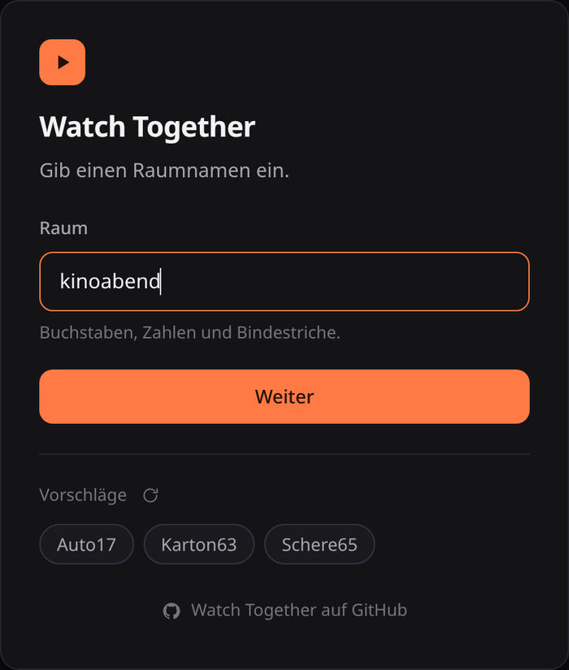
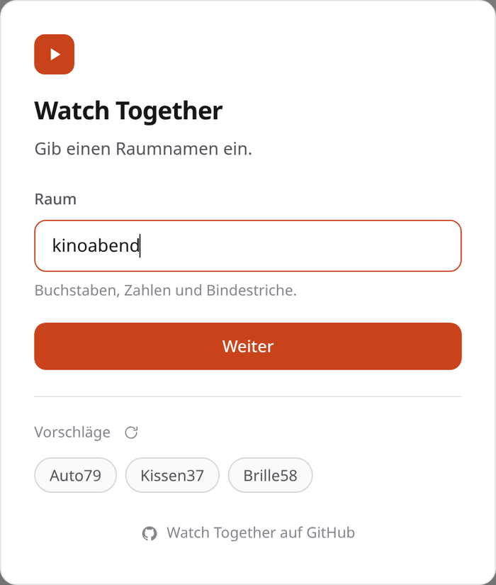

<div align="center">

# 🍿 Watch Together

**Watch your own videos with your friends — in perfect sync, in the browser, on your own server.**

Someone drops a video in, everyone gets the same picture at the same moment.
Pause it, come back tomorrow, and it picks up exactly where you left off.

[](docs/SETUP.md)
[](#-quick-start)
[](docs/SETUP.md#requirements)
[](#-what-is-this)
[](LICENSE)
[](#-what-is-this)



</div>

---

## 🎬 What is this?

Watch Together is a tiny self-hosted watch-party server for **your own video files**.

No accounts, no sign-up, no streaming service in the middle. Start it, send a link
to your friends, and everyone lands in the same room watching the same video at
the same second — whether they're in the next room or on the other side of the
country.

It's built for the simple case: *"I have this video on my disk, let's watch it
together tonight."*

> 🤖 **This project was generated by AI** — written by Claude, directed and
> reviewed by a human.

---

## ✨ Features

### 👥 Watch with as many people as you like
Rooms have no size limit. Everybody who opens the link joins instantly — no
account, no invite, no e-mail address. Pick a name and you're in.

### 🔗 Rooms are just links
Every room has its own URL. Copy it, paste it into your chat, done. If the room
doesn't exist yet, it's created the moment the first person walks in.

### ⏱️ Playback stays in sync — by itself
One person leads, everyone else follows automatically. Play, pause and seeking are
shared instantly.

If someone drifts a little out of step, their player quietly speeds up or slows
down by 20% until they're back in line — no visible jump, no "3, 2, 1, play!"
countdown. Only when the gap gets really big does it snap to the right spot and
say so.

### 🎬 Nobody misses the opening
Switch to another video and the room waits: a badge counts who already has it
buffered, and playback starts by itself the moment everyone is ready — including
when one video ends and the next one comes up. Impatient? Whoever holds the
controls can hit play and it starts straight away, however far along the others
are.

### 👑 Anyone can take the lead
There's no fixed host — but at any moment exactly one person holds the controls,
and the viewer list shows who. Everyone else sees play, pause, the ten-second
jumps and the timeline greyed out; pressing them says what's missing instead of
stopping the film for the whole room. One click on **Take control** and they're
yours.

### 🖥️ Share your screen, live
Whoever holds the controls can start a livestream instead of playing a video —
their screen (and, if they allow it, its audio) goes out to everyone in the
room over WebRTC, no dedicated TURN server required. A **Live** badge appears
on the picture, the viewer list swaps everyone's position for a green or red
dot showing whether their stream connection is up, and playback controls grey
out since there's nothing to pause or seek in a live picture. Drops and
reconnects on its own if the connection hiccups.

<p align="center">
  
  
</p>

See [Screen sharing](docs/livestream.md) for how it's built.

### ✅ Ready when everyone is (optional)
Switch the ready check on and a video change works like a lobby in a game: a
striped overlay lies over the picture with one big button in the middle, red
until you're ready and green once you are, and the viewer list colours everyone
the same way. Playback starts by itself the moment the last person is ready.

The same goes for walking into a room that still has a video sitting at the very
start — that one hasn't been watched yet either, so it waits for the room. Come
back to a film you left halfway through and it simply picks up where it was, no
waiting.

Otherwise the check stays out of the way: pausing and resuming during a video is
unaffected, and dropping your mark mid-film doesn't stop anything, it just holds
up the next one. Off by default; when it's off, nothing about it is visible.

### 🎛️ A player that doesn't stop by accident
Clicking the picture does **not** pause — one stray click would stop the film for
everyone. Play and pause live in the control bar and nowhere else, the keyboard
has no hold on the video at all, and a click on the video just says so.

Double-click or `F11` switches to full screen, where the title and the controls
lay themselves over the picture and fade away again after five quiet seconds.
Hovering the timeline names the moment under the pointer, two buttons jump ten
seconds either way, and one more gives the video the full width by moving the
viewer list and the queue underneath it.

### ⏸️ Pause today, continue tomorrow
Stop halfway through a movie, close the tab, go to bed. When someone opens the
room again, the video is waiting **at exactly the position you left it** — paused,
ready to go.

### 📤 Upload anything — no file size limit
Videos go up in small pieces, so there's **no 2 GB wall, no PHP upload limit to
tune, nothing to configure**. A 30 GB movie works the same as a 2-minute clip.

You get a real progress bar with speed and time remaining, and you can upload
several files at once. Want to keep watching while it uploads? Minimize the dialog
— the progress keeps ticking away in the corner.

### 📋 A shared queue
Uploads appear in everyone's queue *while they're still uploading*, with progress
and the name of whoever's adding them. Each entry shows a thumbnail, its runtime
and who brought it. Anyone can pick what plays next or remove something.

When a video finishes, the next one starts automatically.

### ⚙️ Settings per room
Three things every room decides for itself, and everyone in it sees the change
straight away.

**Keep the videos.** Normally a video is deleted the moment it has run through.
Turn that off and it simply stays in the queue — and that room survives a
restart of the service too, as long as videos are left in it. This only
postpones deletion, though: a kept room that sits empty for more than 4 hours
is deleted anyway.

**Ready check.** Off by default. Turn it on and a video change waits for the
whole room, as described above.

**Opening and ending.** Give the room a time for the end of the opening and one
for the start of the ending, and a fresh video starts behind its intro and counts
as finished as soon as the credits begin. Handy for a series: an evening of
episodes without the same theme song eight times over. Leave the fields empty and
nothing changes.

### 🙋 See where everyone is
The viewer list shows every person in the room and their exact position in the
video, plus a marker on the timeline. Anyone lagging behind is highlighted, so you
can see at a glance if someone's connection is struggling.

And when a connection doesn't just struggle but dies, the room notices: every
browser sends a quiet heartbeat, and whoever goes silent for ten seconds is taken
out of the list. No ghosts left sitting there holding up the next video.

### 🕘 A log of what just happened
Under the player, a small table records the moves that matter — started, paused,
switched, added, removed — with the time and who did it. It lives entirely in your
browser: nothing is stored on the server, and it starts empty the moment you join,
so it only ever shows what happened while you were there.

### 🔊 Your volume is *your* volume
Everything is synced except the sound. Turn it down, mute it, crank it up — it
only affects you, and your browser remembers it for next time.

### 🌗 Light, dim or dark — and your language
One click on the theme icon cycles through three looks: bright **light**, a
soft **dim** grey for evenings when full dark feels like too much, and true
**dark** for movie-night black. The interface also follows your system theme
and your browser language out of the box, and you can override either. Your
choices are remembered locally.

<p align="center">
  
</p>

### 🍓 Names, without the thinking
Can't come up with a room name? The app suggests some. Rooms get everyday objects
(`Kugelschreiber43`, `Uhr12`), people get fruit (`Erdbeere93`, `Banane33`).

---

## 📸 Screenshots

<table>
  <tr>
    <td width="50%"></td>
    <td width="50%"></td>
  </tr>
  <tr>
    <td align="center"><b>Dark mode</b></td>
    <td align="center"><b>Light mode</b></td>
  </tr>
  <tr>
    <td width="50%"></td>
    <td width="50%"></td>
  </tr>
  <tr>
    <td align="center" colspan="2"><b>Joining a room — a name is all it takes</b></td>
  </tr>
</table>

---

## 🚀 Quick start

Everything runs in **one container**. No database to set up, no volume to mount,
no reverse proxy needed to get going.

```bash
git clone https://github.com/WeslieDE/OpenWatchTogether.git
cd OpenWatchTogether

docker build -t watch-together .
docker run --rm -p 8080:80 \
  -p 42000:42000/tcp \
  -p 42000:42000/udp \
  -e WT_SFU_ANNOUNCED_IP=your.server.ip \
  watch-together
```

Open <http://localhost:8080>, pick a room name, pick your name — done. Send the
URL from your address bar to whoever should join.

The extra `42000` port and `WT_SFU_ANNOUNCED_IP` are for screen sharing — set
the variable to your server's public IP (or `127.0.0.1` when just trying it out
on your own machine). Without it, everything else works fine, only the
livestream feature won't connect for anyone outside your machine.

> 📖 **[Full setup guide →](docs/SETUP.md)**
> Docker Compose, reverse proxy & HTTPS, manual PHP installation, every
> configuration option, technical details and troubleshooting.

---

## 💡 Good to know

**Everything is deleted when the service restarts — on purpose.** A watch party
leaves no trace: no disk slowly filling up, no volume to mount, no backups to
think about. As long as the service keeps running, your room stays exactly as you
left it, including the spot you paused at. The one exception is a room you
explicitly told to keep its videos — and even that only buys it 4 extra hours
once it sits empty.
→ [Details](docs/SETUP.md#nothing-survives-a-restart--and-why-thats-good)

**Formats:** anything the browser plays directly — MP4, WebM, OGG — uploads
straight away. MKV, AVI and MP3 are converted to MP4 in the browser first
(MP3 gets a static cover image as its video track), desktop only.
→ [Details](docs/SETUP.md#formats)

**Privacy:** videos are renamed to random names and served straight from the
web server (not through PHP), under a URL that's hard to guess but not
access-controlled. Your name, theme and volume never leave your browser.

**Under the hood:** one HTML page, a plain PHP API for uploads and rooms, and a
long-running PHP process handling the live connection over WebSockets.
→ [Details](docs/SETUP.md#technical-details)

---

## ❓ FAQ

**Is there really no file size limit?**
Correct. Uploads are split into chunks, so PHP's `upload_max_filesize` never gets
in the way. Set `WT_MAX_BYTES` if you *want* a limit for your installation.

**Can I cancel an upload?**
Any time — individually or all at once, and the queue entry disappears for
everyone.

**Do I need accounts or a database server?**
Neither. No login, no PostgreSQL, no Redis — just the container.

**Does it work on a phone?**
Yes, the interface adapts. Mobile browsers still need one manual tap to start
playback the first time.

**Can we watch YouTube or Netflix together?**
No — this is for your own video files, not for streaming services.

**How many people fit in a room?**
There's no built-in limit. What matters is your server's upload bandwidth, since
everyone streams the video from it.

---

## 🤝 Contributing

Issues and pull requests are welcome. If you're reporting a sync problem, it helps
a lot to mention your browser, how many people were in the room, and whether
you're running behind a reverse proxy.

---

## 📄 License

[MIT](LICENSE) — do whatever you like with it: use it, change it, share it, ship
it. Provided **as is**, without any warranty.

---

<div align="center">

Made for movie nights that shouldn't need a countdown. 🎬

</div>
